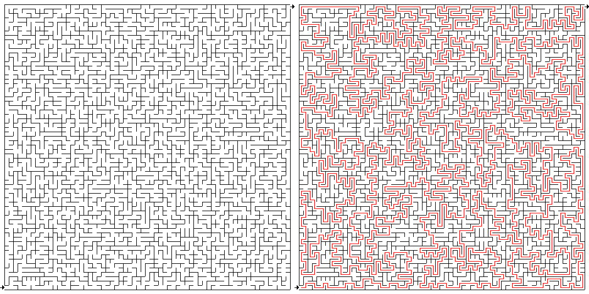

[Jananese](README_ja.md)/ English

# Painful Maze

## Summary

Maze a maze with painfully long path.

## Usage 

    $ make 

# Synopsis

    $ ruby maze.rb size threshold

### Size

Size of the maze. Integer > 2.
The size of the maze is 2**(size+1) + 1.
For example, a maze of 65 time 65 will be made when size = 5.

### Threshold

The length of the path of the maze. Real > 0.25 and < 1.0.
As the threshold becomes larger, the path becomes longer, but the maze becomes easier.

## Output

